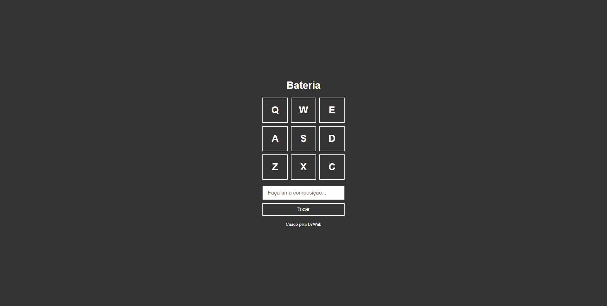
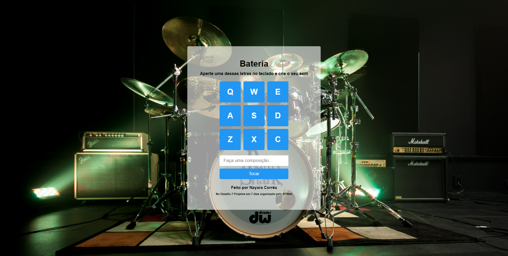

<h1 align="center">  Projeto Bateria </h1>


<p align="center">
 <a href="#-sobre-o-projeto">Sobre</a> •
 <a href="#-funcionalidades">Funcionalidades</a> •
 <a href="#-layout">Layout</a> • 
 <a href="#-como-executar-o-projeto">Como executar</a> • 
 <a href="#-tecnologias">Tecnologias</a> • 
 <a href="#-autora">Autora</a> 
</p>


## 💻 Sobre o projeto

Aplicação desenvolvida durante o <a href='https://b7web.com.br/d7/?d=1' target="_blank"> Desafio 7 Projetos em 7 Dias criado pelo B7Web </a>.
A ideia é expandir um pouco mais os conhecimentos em Javascript e esse projeto foi feito no primeiro dia do desafio.


## ⚙️ Funcionalidades

- [x] Som de bateria ao apertar uma tecla
- [x] Criar composição e depois executá-la


## 🎨 Layout

### Layout Original

Layout desenvolvido pela B7Web


<p align="center" style="display: flex; align-items: center; justify-content: center;">
  
</p>


### Layout Atualizado

Layout atualizado por mim

<p align="center" style="display: flex; align-items: center; justify-content: center;">
  
</p>


## 🚀 Como executar o projeto

Deixarei aqui duas formas para rodar o projeto


### Pré-requisitos

Sugiro a utilização de um bom editor para trabalhar com o código como [VSCode](https://code.visualstudio.com/)


### 🧭 Rodando a aplicação web

#### Primeiro opção

```bash

# 1. Clone este repositório
$ git clone git@github.com:nayaracorrea/drum_project.git

```

2. Abra a pasta do projeto
3. Execute o arquivo index.html

#### Segunda opção

```bash

# 1. Clone este repositório
$ git clone git@github.com:nayaracorrea/drum_project.git

# 2. Acesse a pasta do projeto no seu terminal/cmd
$ cd drum_project

# 3. Vá para a pasta da aplicação Front End
$ cd drum_project

# 4. Abra o projeto no VSCode
$ code .

```

5. Com o projeto aberto clique com o botão em cima do arquivo index.html e depois clique em Open with Live Server (Abrir com Live Server)

> Obs.: Caso não tenha essa opção é necessário instalar a extensão Live Server no seu VSCode.


## 🛠 Tecnologias

As seguintes ferramentes foram usadas na construção do projeto:

-  **[HTML](https://developer.mozilla.org/pt-BR/docs/Web/HTML)**
-  **[JavaScript](https://developer.mozilla.org/pt-BR/docs/orphaned/Web/JavaScript)**
-  **[CSS](https://devdocs.io/css/)**


## 💪 Como contribuir para o projeto

1. Faça um **fork** do projeto.
2. Crie uma nova branch com as suas alterações: `git checkout -b my-feature`
3. Salve as alterações e crie uma mensagem de commit contando o que você fez: `git commit -m "feature: My new feature"`
4. Envie as suas alterações: `git push origin my-feature`


## 🙋 Autora


<a href="https://app.rocketseat.com.br/me/nayaraflorentino-1602180404901">
 
 <br />
 <sub><b>Nayara Corrêa</b></sub></a> <a href="https://app.rocketseat.com.br/me/nayaraflorentino-1602180404901" title="Rocketseat">🚀
 </a>


Feito por Nayara Corrêa 👋🏽 Entre em contato!

[](https://www.linkedin.com/in/nayara-corr%C3%AAa-03bb91149/) 
[](mailto:nayara.florentino@gmail.com)